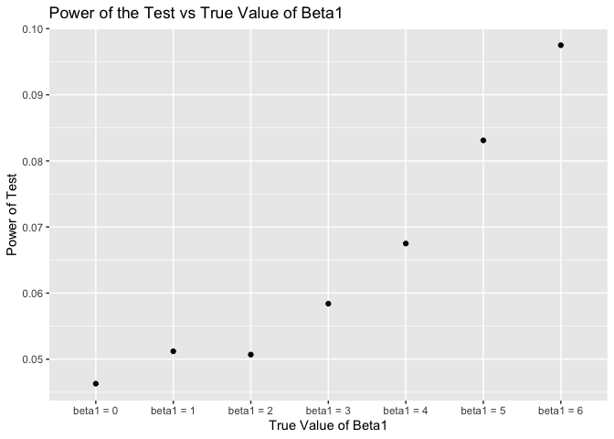

p8105\_hw5\_ml4420
================

## Problem 1

``` r
set.seed(10)

iris_with_missing = iris %>% 
  map_df(~replace(.x, sample(1:150, 20), NA)) %>%
  mutate(Species = as.character(Species))


fill_in_missing = function(x) {
  
  # for numeric variables fill in missing values with mean of non-missing values
  if (is.numeric(x)) {
   
    mean_x = mean(x, na.rm = TRUE)
   
    x=ifelse(is.na(x), mean_x, x)
  } 
  
  # for char variables fill in missing values with "virginica"
  else  {
    x=ifelse(is.na(x),"virginica", x) 
   
  }
  
}
# apply function to iris_with_missing
output = map_df(.x = iris_with_missing, ~ fill_in_missing(.x))  
output
```

    ## # A tibble: 150 x 5
    ##    Sepal.Length Sepal.Width Petal.Length Petal.Width Species
    ##           <dbl>       <dbl>        <dbl>       <dbl> <chr>  
    ##  1         5.1          3.5         1.4         0.2  setosa 
    ##  2         4.9          3           1.4         0.2  setosa 
    ##  3         4.7          3.2         1.3         0.2  setosa 
    ##  4         4.6          3.1         1.5         1.19 setosa 
    ##  5         5            3.6         1.4         0.2  setosa 
    ##  6         5.4          3.9         1.7         0.4  setosa 
    ##  7         5.82         3.4         1.4         0.3  setosa 
    ##  8         5            3.4         1.5         0.2  setosa 
    ##  9         4.4          2.9         1.4         0.2  setosa 
    ## 10         4.9          3.1         3.77        0.1  setosa 
    ## # … with 140 more rows

## Problem 2

``` r
## create dataframe containing all file names
files = list.files("./data")
files_df = tibble(files)

## iterate over file names and read in data for each subject 
file_plot = files_df %>%
  mutate(file_contents = map(files, ~read_csv(file.path("./data", ., fsep = "/")))) %>%
  unnest(file_contents) %>%
  janitor::clean_names() %>%
  separate(files, into = c("arm", "subject_id")) %>%
  mutate(
   group =  factor(ifelse(arm == "con", "control arm", "experimental arm" )),
   subject_id = factor(subject_id)
  ) %>%
  pivot_longer(
    week_1:week_8,
    names_to = "number_of_week",
    values_to = "value"
  ) %>%
  group_by(group,subject_id) %>%
  ggplot(aes(x = number_of_week, y = value, group = arm, colour = group, group = subject_id))+
  geom_path()

file_plot
```

<!-- -->
Comparing the control group against the experimental group, we can see
that the data for each participants in the experimental group is
significantly higher in value than the measurements in the control
group.

## Problem 3

``` r
set.seed(10000)

sim_regression = function(beta1, n = 30, beta0 = 2) {
  
  sim_data = tibble(
    x = rnorm(n),
    y = beta0 + beta1 * x + rnorm(n, 0, 50)
  )
  
  ls_fit = lm(y ~ x, data = sim_data) 
  tibble(
    beta1_hat = coef(ls_fit)[2],
    p_value = pull(ls_fit %>% broom::tidy() %>% filter(term == "x"), p.value)
  )
}


beta1_list = list("beta1_0" = 0,
                  "beta1_1" = 1,
                  "beta1_2" = 2,
                  "beta1_3" = 3,
                  "beta1_4" = 4,
                  "beta1_5" = 5,
                  "beta1_6" = 6)
  output = vector("list", length = 7)
  for(i in 1:7) {
    output[[i]] = rerun(10000, sim_regression(beta1_list[[i]])) %>%
    bind_rows  
  }  
  
  sim_results =
    tibble(beta1_value = c(0, 1, 2, 3, 4, 5, 6)) %>%
    mutate(
      output_lists = map(.x = beta1_value, ~rerun(10000, sim_regression(beta1 = .x))),
      output_dfs = map(output_lists, bind_rows)) %>%
    select(-output_lists)%>%
    unnest(output_dfs)
  sim_results %>%
   
    mutate(
           beta1_value = str_c("beta1 = ", beta1_value),
           beta1_value = fct_inorder(beta1_value)) %>%
     group_by(beta1_value) %>%
    mutate(power_test = sum(p_value < 0.05)/10000) %>%
    select(beta1_value, power_test) %>%
    unique() %>%
    ggplot(aes(x = beta1_value, y = power_test)) +
    geom_point() +
    labs(
    x = "True Value of Beta1",
    y = "Power of Test",
    title = "Power of the Test vs True Value of Beta1"
  )
```

<!-- -->
From the plot, we can see a monotonically increasing relationship
between beta1\_value and power. The effect size is equivalent to the
standardized regression coefficient **beta1** as effect saize is the
difference between the true value and the value specified in the null
hypothesis, which is 0. The power of the test is the probability that
the test rejects the null hypothesis when the alternative is true which
is the proportion of times the null was rejected. **We can then conclude
that, as the effect size increases, the power of the statistical test
increases.**

``` r
plot_1 = sim_results %>%
   
    mutate(
           beta1_value = str_c("beta1 = ", beta1_value),
           beta1_value = fct_inorder(beta1_value)) %>%
    group_by(beta1_value) %>%
    summarise(average_beta1_hat = mean(beta1_hat)) %>%
    select(beta1_value, average_beta1_hat)

# plot showing the average estimate of beta1 hat
plot_1 %>% 
  ggplot( aes(x = beta1_value, y = average_beta1_hat)) +
  geom_point() + 
  labs(
    x = "True Value of Beta1",
    y = "Average Estimate of Beta1",
    title = "Average Estimate of Beta1 vs True Value of Beta1"
  )
```

<!-- -->

``` r
plot_2 = sim_results %>%
   
    mutate(
           beta1_value = str_c("beta1 = ", beta1_value),
           beta1_value = fct_inorder(beta1_value)) %>%
    
    group_by(beta1_value) %>%
    filter(p_value < 0.05) %>% 
    summarise(average_beta1_hat = mean(beta1_hat)) %>%
    select(beta1_value, average_beta1_hat) 
# plot overlaid with beta1 hat only in samples for which the null was rejected
ggplot()+
  geom_point(data = plot_1, aes(x = beta1_value, y = average_beta1_hat, color = "all samples")) +
  
  geom_point(data = plot_2, aes(x = beta1_value, y = average_beta1_hat, color = "samples for which null is rejected")) +
  
  scale_color_manual("Scenarios", values = c("purple", "blue")) +
  labs(
    x = "True Value of Beta1",
    y = "Average Estimate of Beta1",
    title = "Overlaid Plots with Two Scenarios"
  )
```

<!-- -->

The sample average of **beta1 hat** across tests for which the null is
rejected is not approximately equal to the true value of **beta1**.
Instead it is higher than the true value of beta 1.

If the samples are drawn from an underlying normal distribution, the
sampling distributions of **beta1 hat** would be normally distributed
with mean equal to true value **beta1**. However, when we only consider
the cases where the null is rejected, the sampling distributions would
not be normal as can be seen from the graph below.

``` r
sim_results %>%
    mutate(
           beta1_value = str_c("beta1 = ", beta1_value),
           beta1_value = fct_inorder(beta1_value)) %>%
    group_by(beta1_value) %>%
    filter(p_value < 0.05) %>%
    ggplot(aes(x = beta1_hat, color = beta1_value)) +
    geom_density() +
    labs(
      x = "Estimate of Beta1",
      y = "Density",
      title = "Density Plot of Slope Coefficient Estimate"
    )
```

<!-- -->

Under the scenario where only the samples in which the null is rejected
are considered, **beta1 hat** is not normally distributed and its
distribution is asymmetric and right-skewed, as can be seen from the
density plots.

As we can see from the first plot, the greater the effect size
**beta1**, the greater the proportion of times that the null is
rejected. The null is rejected more often means a bigger difference
between **beta1 hat** from the value specified in the null hypothesis
than true value **beta1**.

Therefore the estimate average of **beta1 hat** is higher than the true
value of **beta1**.
